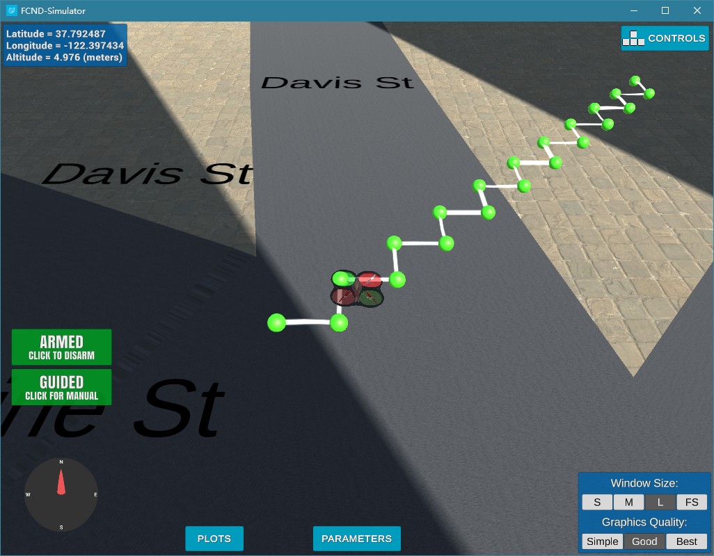
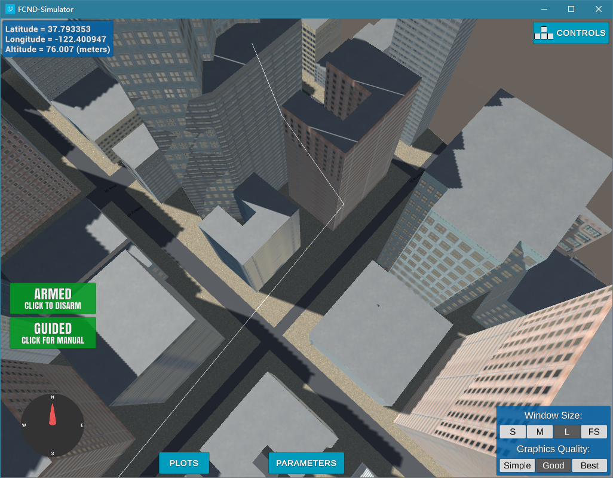

## Project: 3D Motion Planning

---

# Required Steps for a Passing Submission:
1. Load the 2.5D map in the colliders.csv file describing the environment.
2. Discretize the environment into a grid or graph representation.
3. Define the start and goal locations.
4. Perform a search using A* or other search algorithm.
5. Use a collinearity test or ray tracing method (like Bresenham) to remove unnecessary waypoints.
6. Return waypoints in local ECEF coordinates (format for `self.all_waypoints` is [N, E, altitude, heading], where the drone’s start location corresponds to [0, 0, 0, 0].
7. Write it up.
8. Congratulations!  Your Done!

## [Rubric](https://review.udacity.com/#!/rubrics/1534/view) Points
### Here I will consider the rubric points individually and describe how I addressed each point in my implementation.  

---
### Writeup / README

#### 1. Provide a Writeup / README that includes all the rubric points and how you addressed each one.  You can submit your writeup as markdown or pdf.  

You're reading it! Below I describe how I addressed each rubric point and where in my code each point is handled.

### Explain the Starter Code

The starter code is planning a path from (N=0, E=0) to (N=10, E=10) at an altitude equal to TARGET_ALTITUDE. Here is a image of the drone flying in the planned zig-zag path.

#### 1. Explain the functionality of what's provided in `motion_planning.py` and `planning_utils.py`

#### motion_planning.py:

The starter code in motion_planning.py sets up the parameters for the simulation, creates the drone instance and calls the start() method to launch the programmed sequence of actions.

class MotionPlanning(Drone): The MotionPlanning class inherits from Udacity Drone class and describes the drone's behavior in several methods:

init(self, connection): initializes the drone object with connection parameter, sets default state and sets callbacks for managing position, velocity and state events.

local_position_callback(self): manages the position events that are used in the takeoff and waypoint phases of the flight.

velocity_callback(self): manages the velocity events that are used in the landing phase of the flight.

state_callback(self): manages the state events that are used to trigger actions in the pre-flight and post-flight phases.

arming_transition(self): action to arm and take control over the drone before planning and takeoff.

takeoff_transition(self): action to launch takeoff procedure that will target the self.target_position[2] position.

waypoint_transition(self): action to manage the movements of the drone through the self.cmd_position(self.target_position[0], self.target_position[1], self.target_position[2], self.target_position[3]) method that allows to set a target position and ask tell the drone to go there.

landing_transition(self): action to launch landing procedure of the drone at the current location.

disarming_transition(self): action to launch disarming procedure of the drone after landing.

manual_transition(self): action to launch manual procedure of the drone after disarming. It is the last action.

send_waypoints(self): method to send pre-calculated waypoints stored in the data list to the simulator.

plan_path(self): Method where all the flight plan is built as a list of waypoints that will be returned at the end of the method. The purpose is to build a representation of the environment and its constraints and to identify a flight plan allowing to go from start to goal locations.

start(self): starts logging, starts the connection with simulator, and launchs the programmed sequence of actions.

class States(Enum): an Enumeration Class that allows to describe every state that the drone may be in.

#### planning_utils.py:

create_grid(data, drone_altitude, safety_distance): utility method that allows to create a discretized grid representation of the obstacles data provided in the colliders.csv file. The output is a 2D matrix with a 1 in every cell where an obstacle is present and a 0 when space is free. The Origin of the grid is at [0,0] upper left corner. north_min and east_min values allow to adapt obstacle coordinates from a center origin to a lower left origin.

Action(Enum): Action class describing allowed movements on the grid to build the path from start to goal. The cost of the action is also included to allow for optimization of the path through minimization of the cost

valid_actions(grid, current_node): function to identify valid actions from the current position on the grid taking into account the constraints of the obstacles. Valid actions are valid movements in the context of the grid.

a_star(grid, h, start, goal): function implementing a-star search algorithm on a grid to find a path from start to goal using a heuristic function for evaluating the cost of each path.

heuristic(position, goal_position): function returning the cost left to get to the goal. It is used to complement the action cost and hence get a total cost for the action.

### Implementing Your Path Planning Algorithm

#### 1. Set your global home position
I used open() function to open the 'colliders.csv' file. Read the first line containing longitude and latitude using the csv module, split the string and converted the data values to float, and then set the global home position using set_home_position() method to these float values.

### 2. Set your current local position
I used global_to_local() method of Drone class to convert the current global position of the drone to current local location relative to the global home position set in the previous step.

#### 3. Set grid start position from local position
I got the current local position of drone in NED frame in last step, and used it as start position. Before using the same position in grid, I shift the points according to the grid offsets.

#### 4. Set grid goal position from geodetic coords
I added parameter goal to the init() function of MotionPlanning class so that the desired goal location can be passed to MotionPlanning class. Sets the new attribute global_goal to the goal location passed by user. Used this global_goal to set the goal on the grid by applying the same shift as with start location.

#### 5. Modify A* to include diagonal motion (or replace A* altogether)
I used Voronoi graph instead of grid. I updated the A* to work with the graphs that expand to the connected nodes. I also changed the A* implementation so that nodes are only visited if we have found the shortest path to that node and added a condition to replace the old path with the new one if the new path is less costly.

#### 6. Cull waypoints
I culled waypoints in 2D path first, and then culled waypoints in 3D path.

To prune the 2D path I used Bresenham algorithm to remove redundant waypoints.
But after pruning the path I got by running A* on the Voronoi graph was 2D. So to get a 3D path I calculated the difference between the altitude of start and goal location. And given the number of waypoints I found the increment/decrement needed in altitude for each consecutive waypoint.

To cull waypoints in 3D path, I extracted the 2.5D map by using polygons, and used ray tracing to find out if two points connected by one point in the 3D path can be connected. If so, remove the point in the middle and connect the two points directly. Iterate through the nodes to remove further redundant nodes in 3D.
The code here still can be optimized.

Here is a image of not culling waypoints.

Here is a image of culling waypoints in 2D path.

And here is a image of culling waypoints in 2D and 3D path.

### Execute the flighth
#### 1. Does it work?
It works!

### Double check that you've met specifications for each of the [rubric](https://review.udacity.com/#!/rubrics/1534/view) points.

# Extra Challenges: Real World Planning

For an extra challenge, consider implementing some of the techniques described in the "Real World Planning" lesson. You could try implementing a vehicle model to take dynamic constraints into account, or implement a replanning method to invoke if you get off course or encounter unexpected obstacles.
